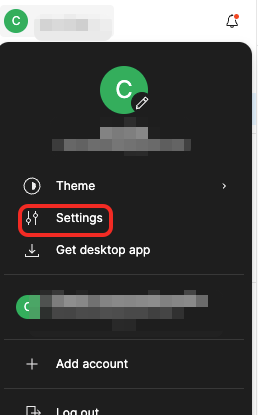
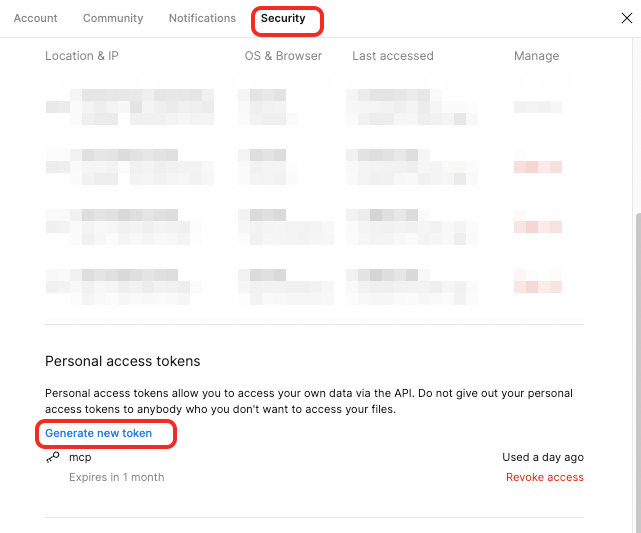
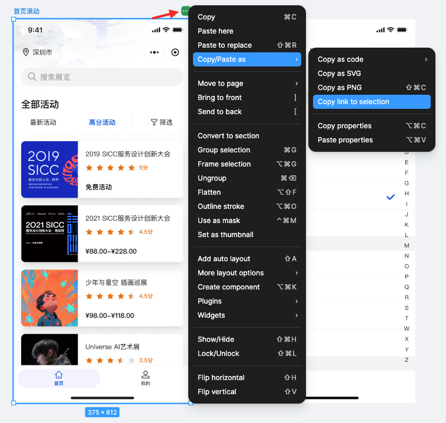
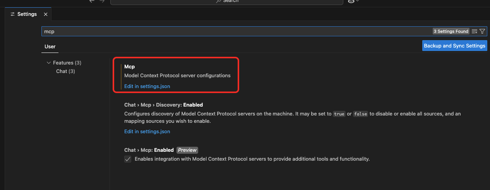
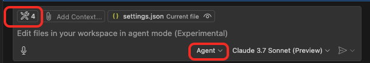

## 前提

Github Copilot 开始支持agent模式。意味着我们可以自定义一些tools去丰富agent的能力。接下来就尝试使用agent模式+figma 去自己生成页面，women以小程序页面为例子。

## 准备

首先，我们需要下载 *vscode insiders* 版本,
其次，我们需要copilot体验或者会员权限，

- [vscode insiders下载地址](https://code.visualstudio.com/insiders/)
- [Figma-Context-MCP](https://github.com/GLips/Figma-Context-MCP)

## 第一步，去拿到figma token 和 link

登录figma，在左上角点击头像



设置token



选择你想要agent去实现的一个页面



拿到link： `https://www.figma.com/design/032otzKny3jVZddIUUilCt/TDesign-for-mobile-(Community)?node-id=30761-32239&t=Qh2z6MyZCgZwOwa4-4`

## 在vscode insiders中配置

打开设置页面，搜索mcp



编辑`settings.json`

```json
{
    "mcp": {
        "inputs": [],
        "servers": {
            "figma": {
                "command": "npx",
                "args": [
                    "-y",
                    "figma-developer-mcp",
                    "--stdio"
                ],
                "env": {
                    "FIGMA_API_KEY": "your-figma-key"
                },
            }
        }
    }
}
```

## 开始Chat

在chat 输入框的左上角，可以看到我们配置的tools

> 注意，选择的是agent mode



这里建议把我们的上下文也加上，点击 `Add Context`

选择一个文件夹，这里假设我们的页面叫activity，在接下的prompt中描述需要在文件夹里面干什么。

测试prompt:

```js
使用Tdesign 原生小程序UI库，开发一个微信小程序页面，
在activity目录下，新建wxml、wxss、js、json文件。
参考链接：{拿到link}

```

回车！

## end

接下来你就可以看到agent自己去搜索理解Tdesgin，

自己去调用figma拿data，然后在你指定的文件夹下输出内容。

> 这里需要注意的是，它还是有概率会无中生有，造一个不是tdesgin的组件来使用。

可以看到，只要UI设计稍微规范一点，agent实现的效果应该是有80%左右的相似度。
