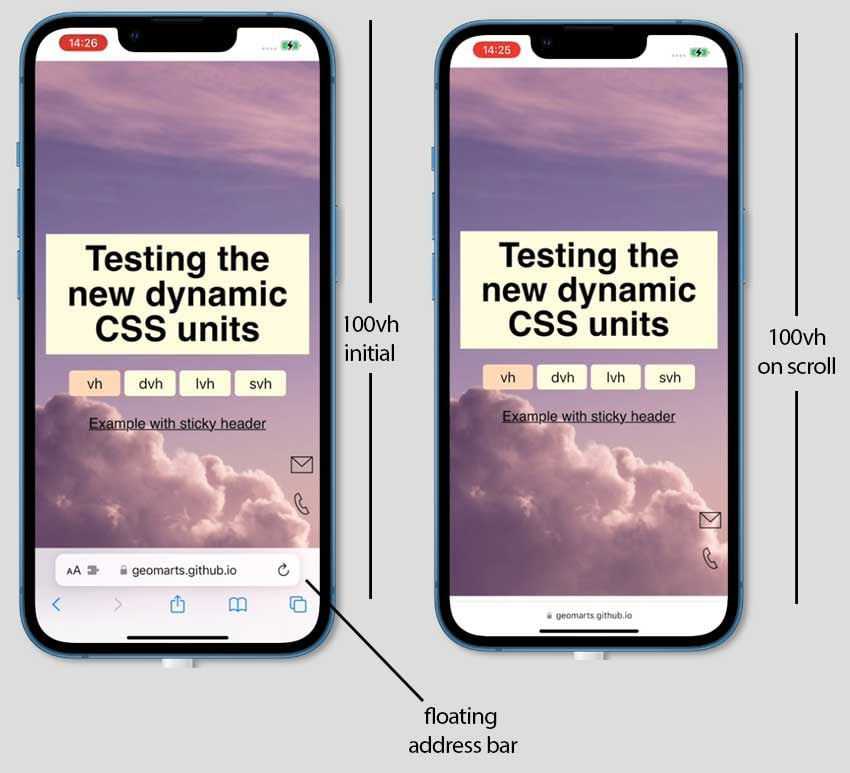
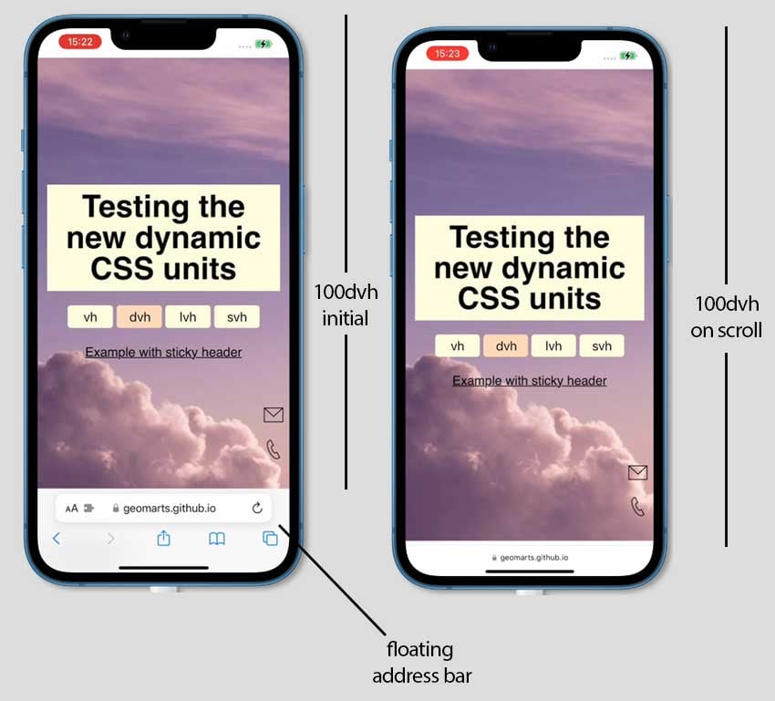
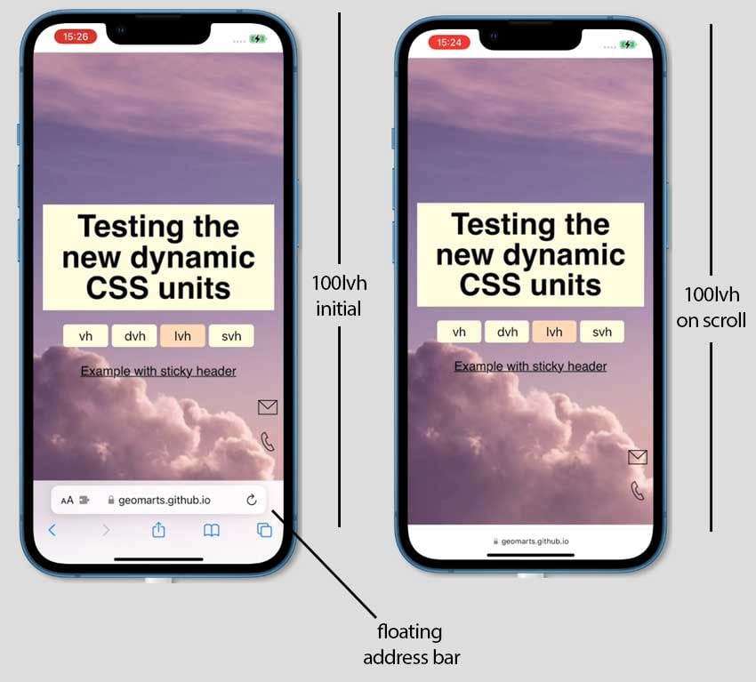
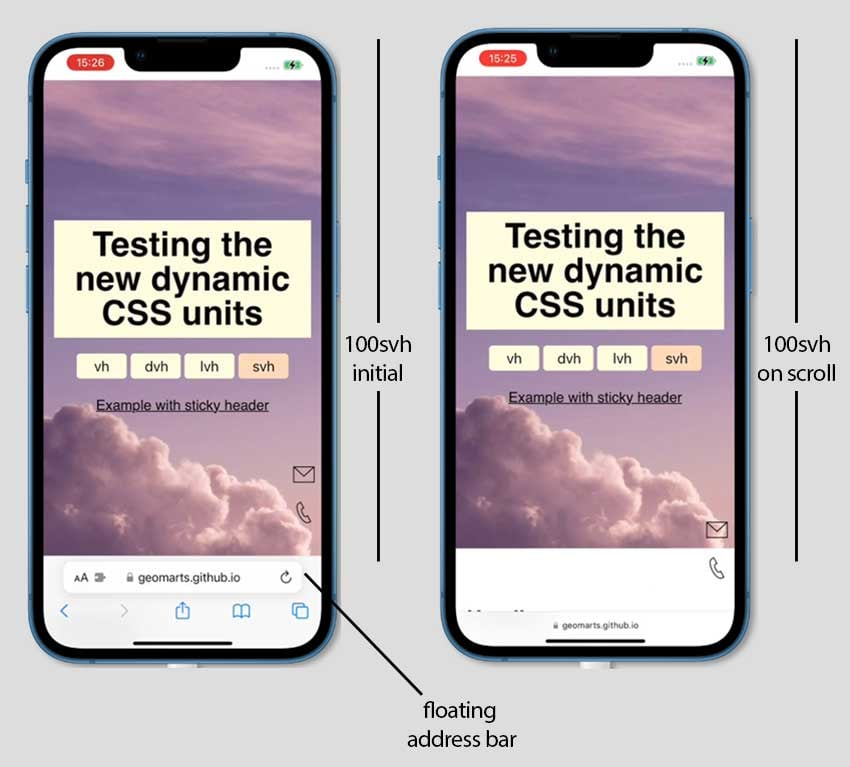

- [Learn These Viewport-Relative CSS Units (100vh, 100dvh, 100lvh, 100svh)](https://webdesign.tutsplus.com/learn-these-viewport-relative-css-units-100vh-100dvh-100lvh-100svh--cms-108537t)

- [看图说话，新 CSS 单位 “svh” “dvh” 原来如此](https://juejin.cn/post/7172332295058751496?searchId=2024041610280856F4151AFCFD08FCCE78)

## 100vh

屏幕高度，在移动端时，视口大小受是否存在动态工具栏的影响。地址栏和标签页栏等界面。



## 100dvh

dynamic viewport height

动态视口高度-[w3c文档](https://www.w3.org/TR/css-values-4/#dynamic-viewport-size)



> 无论工具栏是否存在，该单元总是尝试匹配视口高度.可能会导致页面滚动时跳跃和闪烁。

## 100lvh

large viewport height

大型视口高度-[w3c文档](https://www.w3.org/TR/css-values-4/#large-viewport-size)



不管有没有UA，都是等于最大的视口高度

## 100svh

small viewport height

小型视口高度-[w3c文档](https://www.w3.org/TR/css-values-4/#small-viewport-size)



在展开工具栏时，不会溢出。但是在收起工具栏时，会留白

## 向下兼容的写法

```css
.hero {
  height: 100svh;
  height: 100vh;
}
```
