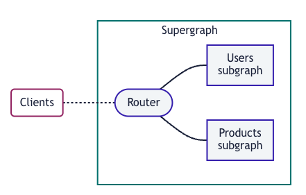

## 前言

阿波罗联邦是一种架构模式



如上图，以一个router为入口，多个子图组成了一个supergraph。

每个子图不限技术栈，不限团队。

### Router

Router其实是一个服务，也可以包含鉴权、缓存、日志等功能，可以看成一个api gateway。

可以通过GraphOS去使用它

也可以下载它的二进制文件，去本地运行它（当然，需要一些额外配置）

### 子图

每个子图其实就是一个grapgql service 实例。里面需要实现对应的resolvers

如上描述，子图可以使用任意的兼容的 GraphQL 服务器库。不限于javascript、java、py等

## router实现

基于apollo下，router的实现有两种选择

- Apollo Router

- 基于Apollo Service 的`@apollo/gateway`库

第二种方式没啥好说的，就是按照`@apollo/gateway`的方式来组装，看文档编写。

如果要使用第一种，官方推荐是使用Apollo GraphOS + Apollo Router 这种方式去管理超图和子图（虽然方便但是要$），其实就是购买saas服务，虽然有免费版本。

想使用Apollo Router但是不想依赖GraphOS，希望本地去运营的，有没有其他方法？

答案是： 有

[Local composition](https://www.apollographql.com/docs/federation/quickstart/local-composition)

## The Rover CLI

Rover 是用于使用 Apollo GraphOS 管理和维护图形的命令行界面。

它能够通过声明的yaml文件，去组装一个超图。并输出对应的超图yaml

## supergraph的本地生成

```yaml
# supergraph-config.yaml
federation_version: 2
subgraphs:
  locations:
    routing_url: https://flyby-locations-sub.herokuapp.com/
    schema:
      subgraph_url: https://flyby-locations-sub.herokuapp.com/
  reviews:
    routing_url: https://flyby-reviews-sub.herokuapp.com/
    schema:
      subgraph_url: https://flyby-reviews-sub.herokuapp.com/

```

Rover的运行需要如上面的yaml，可以看到其中声明了subgraphs集合及对应的路径。

```bash
rover supergraph compose --config ./supergraph-config.yaml
```

运行了`supergraph compose`命令去进行组装操作

```bash
./router --supergraph=supergraph.graphql
```

以生成的超图作为配置文件运行Apollo Router的二进制文件就好了。

## subgraph的实现

到此，我们知道了Router的使用，以及如何构造一个超图。但是我们还不知道子图是怎么来的。我们只知道子图是一个Apollo Service 及一个长成这样的`https://flyby-locations-sub.herokuapp.com/`URL链接

接着往下看

### 基于Apollo Server构造

构造一个subgraph服务，需要依赖`@apollo/subgraph`和`graphql-tag`库，

```shell
npm install @apollo/subgraph graphql-tag
```

然后转化类型和Query

```ts
const typeDefs = gql`
  type Book {
    title: String
    author: String
  }

  type Query {
    books: [Book]
  }
`;
```

> 我们将模式包装在 gql 标签中，将其转换为 AST（即 DocumentNode）。我们这样做是因为下面的 buildSubgraphSchema 函数要求我们传入的模式是 DocumentNode 类型

然后创建server

```ts
const server = new ApolloServer({
  schema: buildSubgraphSchema({ typeDefs, resolvers }),
});
```

## 总结

上面一套下来，实现的就是

基于本地Apollo Router去实现的联邦模式

当然，细节问题需要进一步处理。

