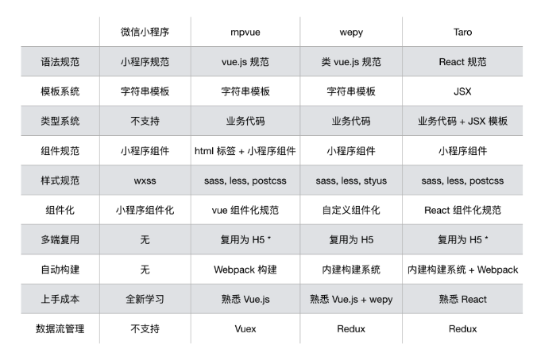
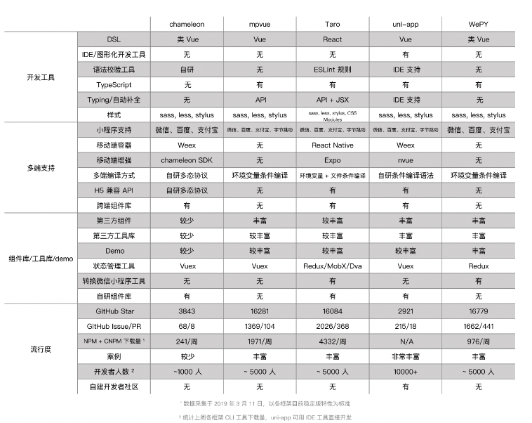

  > 希望能够使用 React 语法写小程序的同时，通过「**Write once Run anywhere**」来实现跨端的。

 [《小程序跨框架开发的探索与实践》演讲全文](https://docs.taro.zone/blog/2020-01-02-gmtc/)

### 选型参考

#### 一

> 

#### 二

### 架构

#### 3之前的

#### 3之后的

##### 区别

### 重编译和重运行时，而重运行时带来的好处是，模拟DOM/BOM API：

### mpvue

mpvue 本质上还是将 Vue 运行在了小程序，在platform目录下实现了小程序的转化。

### Vue支持

- 从`v3.0.0`版本（01 Jul 2020）支持的vue3开发

### Taro小程序

1. 先基于cli为react/vue代码用webpack打包
2. 运行时使用适配器进行适配，调用Taro实现的DOM/BOM API，
3. 渲染到小程序页面

### Taro DOM Tree 如何更新到页面

#### React

1. 先将小程序的组件模版化
2. 将Taro Runtime 生成的Taro Dom Tree，去匹配模版
3. 匹配遍历完Taro Tree之后，得到的就是小程序的组件Tree

#### Vue

Vue 和 React 最大的区别就在于运行时的 CreateVuePage 方法，这个方法里进行了一些运行时的处理，比如：生命周期的对齐。其他的部分，如通过 BOM/DOM 方法构建、修改 DOM Tree 及渲染原理，都是和 React 一致的。

#### 更新

无论是 React 还是 Vue ，最终都会调用 Taro DOM 方法，如：appendChild、insertChild 等。
这些方法在修改 Taro DOM Tree 的同时，还会调用 enqueueUpdate 方法，这个方法能获取到每一个 DOM 方法最终修改的节点路径和值，如：{root.cn.[0].cn.[4].value: "1"}，并通过 setData 方法更新到视图层。

### Taro NPM

