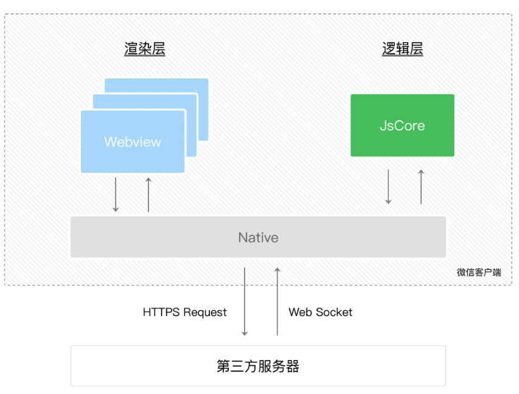
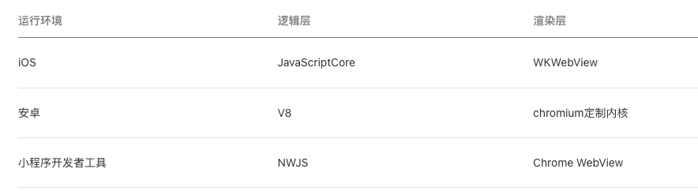

## 历史使命

微信中的webview逐渐成为移动web的入口。

基于微信JS API（​微信官方是没有对外暴露过如此调用的，此类 API 最初是提供给腾讯内部一些业务使用，很多外部开发者发现了之后，依葫芦画瓢地使用了，逐渐成为微信中网页的事实标准。）的能力，2015年初，微信发布了一整套网页开发工具包，称之为 JS-SDK，让所有开发者都可以使用到微信的原生能力，去完成一些之前做不到或者难以做到的事情。

JS-SDK逐渐暴露出一些问题，需要一个全新的系统来完成

- 快速的加载

- 更强大的能力

- 原生的体验

- 易用且安全的微信数据开放

- 高效和简单的开发

小程序呼之欲出

## 主题架构

- [参考链接](https://juejin.cn/post/7140509513852911647)

和我们熟知的浏览器的JS线程和GUI线程互斥不同，小程序的渲染层和逻辑层是分开，两者互不影响。
它们通过native系统层进行通行。

## 运行环境

宿主环境不同，小程序的运行环境也不同，我们所说的宿主，其实就是微信APP。

## 页面生命周期

## 小程序的生命周期

需要知道小程序什么时候会被销毁

- 当小程序进入后台并被「挂起」后，如果很长时间（目前是 30 分钟）都未再次进入前台，小程序会被销毁。
- 当小程序占用系统资源过高，可能会被系统销毁或被微信客户端主动回收。

## 关于小程序更新的注意点

1. 开发者在后台发布新版本之后，无法立刻影响到所有现网用户，正常情况下，在全量发布 24 小时之后，新版本可以覆盖 99% 以上的用户。
2. 小程序管理后台的「优先使用本地版本设置」和「小程序最低可用版本设置」不会影响同步更新与异步更新的选择。

## Skyline渲染引擎

- [拓展阅读](https://www.zhihu.com/question/546709238)

相比于「双线程模型」的架构，Skyline 创建了一条渲染线程来负责 Layout, Composite 和 Paint 等渲染任务（从原来的1:1改成1:N，复用一个渲染器）,并在AppService中新增渲染上下文来运行之前 WebView 承担的 JS 逻辑、DOM 树创建等逻辑。
