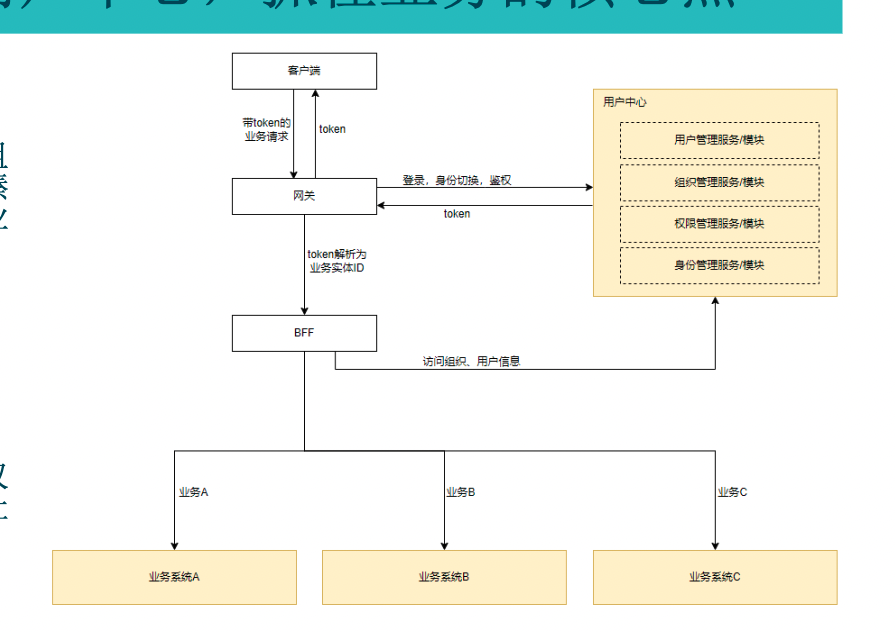
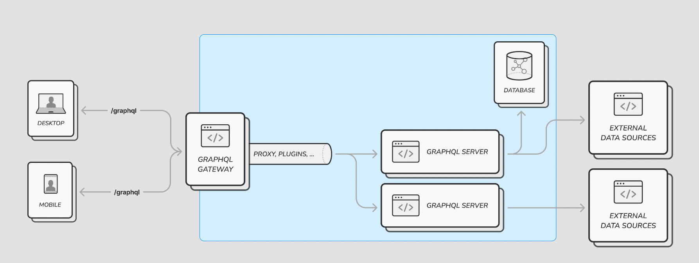
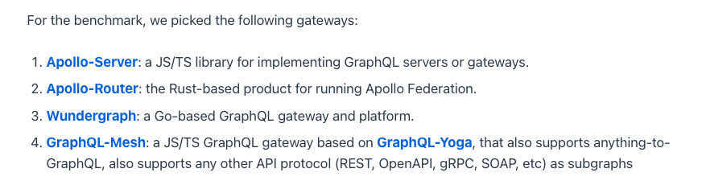
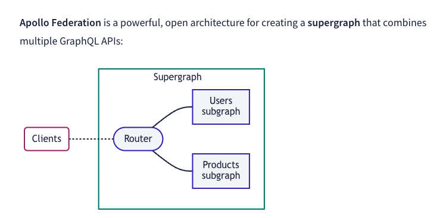
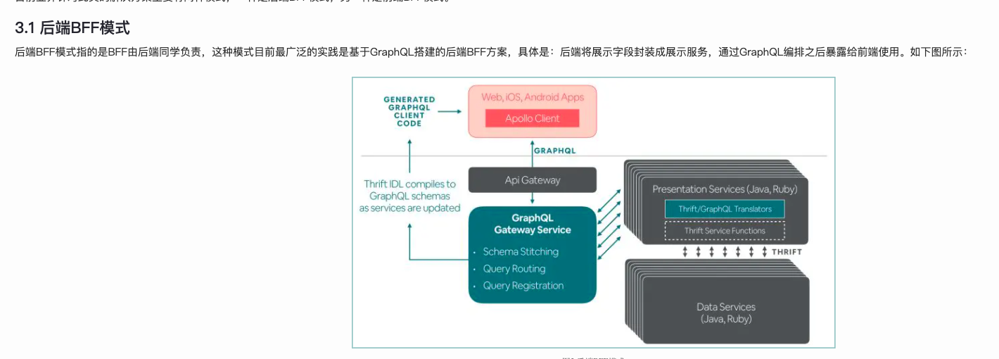

## 初识

### NestJS

nestjs是一个Node服务器端的企业级框架。

内置了graphql模块，提供对graphql的支持。

同时也依赖了@nestjs/apollo包，对应的也可以选择@nestjs/mercurius包

> focus on how to work with the built-in @nestjs/graphql module. The GraphQLModule can be configured to use Apollo server (with the @nestjs/apollo driver) and Mercurius (with the @nestjs/mercurius). We provide official integrations for these proven GraphQL packages to provide a simple way to use GraphQL with Nest (see more integrations here).

### Apollo

Apollo 是一组工具和社区成果，可帮助您在应用程序中使用 GraphQL。它以其客户端和服务器而闻名。

[前端开发使用GraphQL——服务端技术选型](https://cloud.tencent.com/developer/article/1831513)

[5个Nest心动理由](https://juejin.cn/book/7226988578700525605/section/7238472356557570103)

## 背景

主要解决矛盾：服务端单一稳定与端的差异灵活诉求之间的矛盾

### 端存在差异性

1. 场景数据源不一致。服务订单：app端需要所有类型的服务订单，小程序端只需要图文问诊的服务订单，
2. 页面展示字段不一致。app需要展示4个字段，小程序只需要1个字段

### 架构一



使用nestjs+graphql实现了一个graphql service，具体实现看服务端实现

[携程基于 GraphQL 的前端 BFF 服务开发实践](https://www.51cto.com/article/712429.html)

那么问题就来了：

#### 问题1: BFF操作数据是请求后端接口，还是直接连接数据库

如果请求后端接口，那么就会存在：GraphQL服务变成面向数据接口，而非面向数据网络

如果希望实践成面向数据网络，那么对现有RESTful API 的关联关系和设计需要重新评估和实践

> 原本 RESTful API 的接口，只是挂载到 GraphQL 的 Query 或 Mutation 的根节点下，未作其它改动。这种实践模式，只能有限发挥 GraphQL 合并请求、裁剪数据集的作用。它仍然是面向数据接口，而非面向数据网络的。

结论：

还是以restful api的方式请求后端接口，并且graphql实践不会涉及到历史接口，只会在新模块中实行。

要做到面向数据网络，对后端api的设计要求较高，所以需要从这个层面来把控。

#### 问题2: 需不需要连接数据库

参考：
> 所有面向外部用户的 GraphQL 服务，我们会限制只能调用其他后端 API，以避免出现密集计算或者架构复杂的情况。只有面向内部用户的服务，才允许 GraphQL 服务直接访问数据库或者缓存。

结论：

不需要，数据库的操作暂时不会放在其中。

### 架构二

[State of GraphQL Gateways in 2023](https://the-guild.dev/blog/state-of-graphql-gateways-in-2023)



> A GraphQL gateway follows a workflow that adds functionality and acts as a proxy between the consumer and the actual GraphQL server(s) running the GraphQL schema(s)

> The GraphQL server, on the other hand, implements the actual GraphQL schema and runs resolvers, dataloaders, and any other custom code required for fetching and connecting your data or entities.





### 问题1: 需不需要GraphQL getaway

需要：技术选型和demo实现？

- [nestjs+graphql的联邦实现](https://docs.nestjs.com/graphql/federation)

- [Apollo Router的应用](https://www.apollographql.com/docs/router)

结论：

目前来看如果是以前端bff来实现，还是需要GraphQL getaway的。至于哪种方式实现，需要进一步确认。

### 问题2: 前端BFF需不需要实现resolvers

如果实现了，那么BFF其实就是个graphQl service？

如果不实现，那么BFF该做的东西又是什么？

结论：

现在来看，这个resolvers的工作其实还是在bff，了解到不用实现resolvers的方式可以用apollo router去实现gateway，需要进一步确认。

### 问题3: apollo去集成客户端和服务端？

如果我们都是使用apollo去集成客户端和服务端，

同时BFF不实现resolvers

那BFF要做的东西是什么？好像什么都不用做？

结论：

目前的demo是基于apollo去做的，应该也是较成熟和广泛的方案。

### 架构三

[GraphQL及元数据驱动架构在后端BFF中的实践](https://tech.meituan.com/2021/05/06/bff-graphql.html)



这是后端BFF的实现架构

## 实现

### 客户端接入

[Vue Apollo](https://apollo.vuejs.org/)

```js

npm install --save graphql graphql-tag @apollo/client

npm install --save @vue/apollo-composable

```

```js

// graphql实例
const httpLink = createHttpLink({
  // You should use an absolute URL here
  uri: 'http://localhost:3000/graphql'
})

// Cache implementation
const cache = new InMemoryCache()

// Create the apollo client
const apolloClient = new ApolloClient({
  link: httpLink,
  cache
})

const app = createApp({
  setup() {
    provide(DefaultApolloClient, apolloClient)
  },

  render: () => h(App)
})

```

### 服务端实现

[nestjs的示例代码](https://github.com/nestjs/nest/tree/master/sample/)

对于GraphQL的使用

两种模式：

- code first: 使用TypeScript装饰器和类来直接定义GraphQL类型
- schema first: 显式定义GraphQL类型

schema好处：
显式的schema文件，更方便不同团队的参与。简单明了

#### 构建超图的Federation模式

```js
@Module({
  imports: [
    GraphQLModule.forRoot<ApolloGatewayDriverConfig>({
      driver: ApolloGatewayDriver,
      gateway: {
        supergraphSdl: new IntrospectAndCompose({
          subgraphs: [
            { name: 'users', url: 'http://localhost:3000/graphql' },
            { name: 'posts', url: 'http://localhost:3001/graphql' },
          ],
        }),
      },
    }),
  ],
  controllers: [AppController],
  providers: [AppService],
})

```

## 阶段总结

参考图

思考问题： 单个BFF还是多个BFF需要进一步明确?多个bff的架构及实现又该是怎样

- 学习成本/人力成本

  例如：后端服务构造完业务数据关系后，需要转化为对应的图关系，BFF需要应用这层图关系并且实现resolvers，然后在clien端再去联调

- 编码质量/子图设计/性能 等问题如何保证
