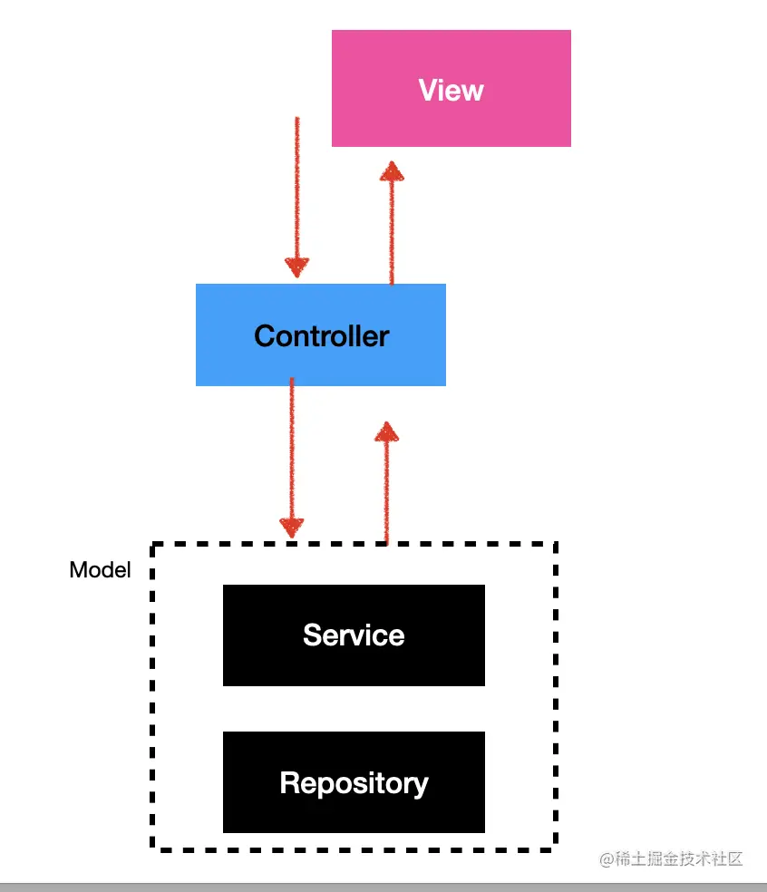
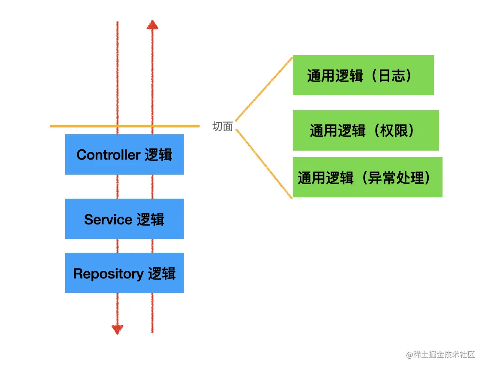

## 一些文档

- [官方文档](https://docs.nestjs.com/)
- [翻译文档](http://nestjs.inode.club/)
- [翻译文档](https://nest.nodejs.cn/)

## 概念

### MVC

### IOC

依赖自动注入，不需要手动处理依赖关系及注入操作，一切都是根据装饰器声明自动扫描并创建注入。

那么nest是如何实现IoC的呢 --- Reflect MetaData

[Nest 的实现原理？理解了 reflect metadata 就懂了](https://juejin.cn/post/7125066863150628900?searchId=2024011118224195363138895777B5DE8C)

> Nest 的 Controller、Module、Service 等等所有的装饰器都是通过 Reflect.meatdata 给类或对象添加元数据的，然后初始化的时候取出来做依赖的扫描，实例化后放到 IOC 容器里。实例化对象还需要构造器参数的类型，这个开启 ts 的 emitDecoratorMetadata 的编译选项之后， ts 就会自动添加一些元数据，也就是 design:type、design:paramtypes、design:returntype 这三个，分别代表被装饰的目标的类型、参数的类型、返回值的类型。

### AOP

面向切面编程

- Middleware
- Guard
- Interceptor
- Pipe
- ExceptionFilter

它们的调用顺序为：

Middleware -> Guard -> Interceptor -> Pipe -> ExceptionFilter

nest继承了express的概念，所以最外层会调用Middleware，
进入具体路由之后，接着调用Guard，例如权限判断，然后会调用Interceptor拦截器
完成之后，调用Pipe对参数做处理，没问题后，才会进入Controller，然后匹配抛出的异常执行ExceptionFilter

## 控制器

### 作用域

TODO

## 模块（Modules）

- 模块的生命周期是怎样的
- 一个共享模块被修改值后，是否会影响到所有使用这个模块的其他模块
- 同一模块被导入，又被导出的意义是什么
