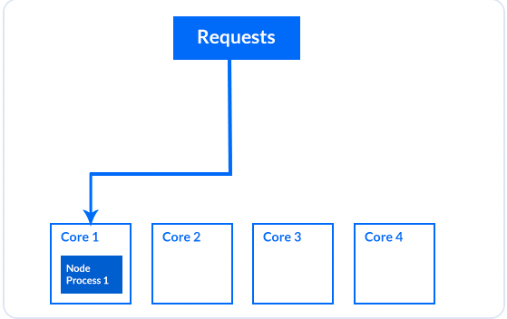
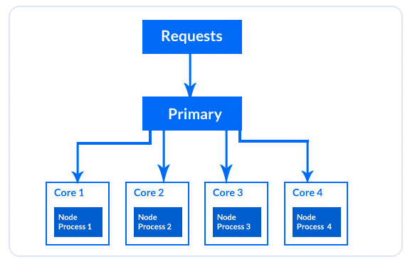
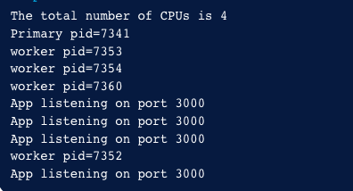
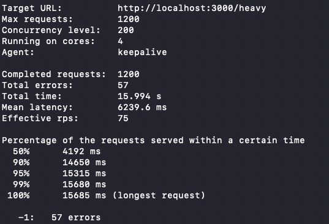

  # 如何通过集群扩展 Node.js 应用程序

- [原文链接](https://www.digitalocean.com/community/tutorials/how-to-scale-node-js-applications-with-clustering#prerequisites)  
- [演示代码](https://github.com/Capchen/cluster_demo)

## 介绍

当你在一个多核CPU的系统上运行一个node程序，默认情况下会以单核的模式去创建一个进程。因为Node.js是以单线程的方式执行javascript代码，所以应用的所有请求都必须由单核上的线程去处理。如果应用程序有 CPU 密集型任务，操作系统必须安排它们共享单个 CPU，直到完成。如果单个进程收到太多请求，可能会导致该进程不堪重负，从而导致性能下降。如果进程崩溃了，用户也不能继续访问你的应用了。

Node.js引入了cluster模块去解决这个问题，它会在同一台计算机上创建同一个应用程序的多个副本并让它们同时运行。同时它也使用了[round-robin 算法](https://en.wikipedia.org/wiki/Round-robin_scheduling)去实现负载均衡。如果一个实例崩溃了，剩下运行中的实例依然可以为用户提供服务。得益于负载均衡，应用的性能也会显著提高。

在本教程汇总，你将会在一台拥有四个或更多个 CPU 的机器上，使用 Node.js 的集群（cluster）模块来扩展一个应用程序。您将创建一个不使用集群的应用程序，然后将该应用改进到使用集群模块。你还将使用 pm2 模块来将应用程序扩展到多个 CPU。你将使用负载测试工具来比较使用集群和不使用集群的应用程序的性能，以及评估 pm2 模块的表现。

## 准备

要跟随学习本教程，你需要：

1. 大于或等于4核系统

    a. 如果您使用的是 Ubuntu 22.04 远程服务器，您可以按照我们的[初始服务器设置](https://www.digitalocean.com/community/tutorials/initial-server-setup-with-ubuntu-22-04)来设置您的系统.

2. 在您的开发环境中设置 Node.js(最好大于16)。

3. 对express的基本了解

## 步骤一：创建目录

在这一步中，你将创建项目的目录并下载应用程序所需的依赖。在第二步中，你将使用 Express 构建应用程序。然后在第三步中，你将使用内置的 node-cluster 模块将其扩展到多个 CPU，在第四步中会使用 loadtest 软件包进行压力测试。接着你将使用 pm2 软件包扩展当前应用，并在第五步中再次进行压力测试。

首先，创建一个目录。您可以将其命名为 cluster_demo 或您喜欢的任何目录名称，然后进入目录，接着对其初始化

``` bash
# 创建目录
mkdir cluster_demo

# 进入目录
cd cluster_demo

# 初始化
npm init -y
```

-y 选项告诉 NPM 接受所有默认选项。

``` javascript
{
  "name": "cluster_demo",
  "version": "1.0.0",
  "description": "",
  "main": "index.js",
  "scripts": {
    "test": "echo \"Error: no test specified\" && exit 1"
  },
  "keywords": [],
  "author": "",
  "license": "ISC"
}
```

这些属性需要与项目保持一致：

- name：npm 包的名称。
- version：你的包的版本号。
- main：项目的入口点。

在 package.json 文件中，添加启用对 ES 模块的支持：

``` javascript
{
  ...
  "author": "",
  "license": "ISC",
  "type": "module"
}

```

接着，下载一些依赖包

- express：一个用于在 Node.js 中构建 Web 应用程序的框架。
- loadtest：一种负载测试工具，可用于生成应用程序的流量以测量其性能。
- pm2：一种自动将应用程序扩展到多个 CPU 的工具。

``` zsh
npm install express

npm install -g loadtest pm2
```

## 步骤二：创建不使用集群的应用

在这一步中，您将创建一个包含单个路由的示例程序，该路由将在每个用户访问时启动CPU密集型任务。该程序不会使用集群模块，因此您可以访问在一个CPU上运行应用程序的单个实例的性能影响。在本教程的后面，您将比较这种方法与集群模块的性能。

首先，创建`index.js`文件

``` js
import express from "express";

const port = 3000;
const app = express();

console.log(`worker pid=${process.pid}`);
```

在第一行，导入express包。在第二行中，将端口变量设置为端口3000，应用程序的服务器将侦听该端口。接下来，将app变量设置为Express的实例。之后，您可以使用内置的进程模块在控制台中记录应用程序进程的进程ID。

然后，新增一个路由，它是一个CPU 密集的循环操作

``` js
...
app.get("/heavy", (req, res) => {
  let total = 0;
  for (let i = 0; i < 5_000_000; i++) {
    total++;
  }
  res.send(`The result of the CPU intensive task is ${total}\n`);
});
```

在/ heavy路径中，你定义了一个循环，将总变量增加了500万次。然后使用res. send ()方法发送包含总变量中的值的响应。虽然CPU受限任务的示例是任意的，但它演示了CPU受限任务，而没有增加复杂性。你也可以为路由使用其他名称，但本教程使用/ heavy表示繁重的性能任务。

接下来，调用 Express 模块的 Listen() 方法，让服务器监听存储在 port 变量中的端口 3000：

```js
...
app.listen(port, () => {
  console.log(`App listening on port ${port}`);
});
```

`index.js`完整代码如下：

```js
import express from "express";

const port = 3000;
const app = express();

console.log(`worker pid=${process.pid}`);

app.get("/heavy", (req, res) => {
  let total = 0;
  for (let i = 0; i < 5_000_000; i++) {
    total++;
  }
  res.send(`The result of the CPU intensive task is ${total}\n`);
});

app.listen(port, () => {
  console.log(`App listening on port ${port}`);
});
```
启动服务

`node index.js`

输出显示正在运行的进程的进程 ID 以及确认服务器正在侦听端口 3000 的消息。 要测试应用程序是否正常工作，请打开另一个终端并运行以下命令：

```bash
worker pid=11023
App listening on port 3000
```

可以在浏览器中直接打开
`http://localhost:3000/heavy`

也可以在终端中执行curl
`curl http://localhost:3000/heavy`

当你使用node命令运行index. js文件时，操作系统（OS）会创建一个进程。进程是操作系统为运行程序所做的抽象。操作系统为程序分配内存，并在进程列表中创建一个对应运行程序的进程ID。

程序二进制文件会被定位并加载到为进程分配的内存中。从那里开始执行。运行时，它对系统中的其他进程没有任何感知，并且在该进程中发生的任何事情都不会影响其他进程。

由于您在具有多个CPU的服务器上运行Node.js应用程序只有一个进程，因此它将接收并处理所有传入请求。在此图中，所有传入请求都被定向到在单个CPU上运行的进程，而其他CPU保持空闲：



## 步骤三：创建集群应用

在这一步中，你将添加集群（cluster）模块，以创建同一程序的多个实例，以处理更多的负载并提高性能。当你使用集群模块运行进程时，你可以在你的机器上的每个 CPU 上运行多个进程：



在这个图示中，请求通过主进程中的负载均衡器，然后使用循环轮询算法将请求分发到各个进程之间。

现在来创建`primary.js`文件

``` js
import cluster from "cluster";
import os from "os";
import { dirname } from "path";
import { fileURLToPath } from "url";

const __dirname = dirname(fileURLToPath(import.meta.url));
```

在前两行中，导入了集群（cluster）和操作系统（os）模块。在接下来的两行中，导入了 dirname 和 fileURLToPath，它们用于将 __dirname 变量的值设置为执行 index.js 文件所在目录的绝对路径。因为当使用 ES 模块时，__dirname 并未定义，它默认只在 CommonJS 模块中定义。

接下来，添加以下代码来引用index.js文件：

```js
const cpuCount = os.cpus().length;

console.log(`The total number of CPUs is ${cpuCount}`);
console.log(`Primary pid=${process.pid}`);
cluster.setupPrimary({
  exec: __dirname + "/index.js",
});
```

首先，我们将 cpuCount 变量设置为你的计算机上的 CPU 数量，应该是四个或更多。接下来，在控制台中打印了 CPU 数量和主进程的进程 ID，这个主进程将接收所有的请求，并使用负载均衡器将它们分发给工作进程。

随后，你使用集群（cluster）模块的 setupPrimary() 方法引用了 index.js 文件，以便在每个工作进程中执行。

然后，添加以下代码来创建进程：

```js
...
for (let i = 0; i < cpuCount; i++) {
  cluster.fork();
}
cluster.on("exit", (worker, code, signal) => {
  console.log(`worker ${worker.process.pid} has been killed`);
  console.log("Starting another worker");
  cluster.fork();
});
```

以上代码会循环迭代cpu的数量，并在每次迭代中调用集群（cluster）模块的 fork() 方法。同时使用集群模块的 on() 方法附加了 exit 事件，以便监听进程何时发出 exit 事件，通常是当进程终止时。当触发 exit 事件时，你会记录已终止的工作进程的进程 ID，然后调用 fork() 方法创建一个新的工作进程，以替换已终止的进程。

完整代码如下：

```js
import cluster from "cluster";
import os from "os";
import { dirname } from "path";
import { fileURLToPath } from "url";

const __dirname = dirname(fileURLToPath(import.meta.url));

const cpuCount = os.cpus().length;

console.log(`The total number of CPUs is ${cpuCount}`);
console.log(`Primary pid=${process.pid}`);
cluster.setupPrimary({
  exec: __dirname + "/index.js",
});

for (let i = 0; i < cpuCount; i++) {
  cluster.fork();
}
cluster.on("exit", (worker, code, signal) => {
  console.log(`worker ${worker.process.pid} has been killed`);
  console.log("Starting another worker");
  cluster.fork();
});
```

现在可以`node primary.js`启动服务，观察输出.可以看到服务以集群的方式启动了。


## 步骤四：使用测试工具对比性能

在这一步中，你将使用 loadtest 软件包对你构建的两个程序生成流量。你将比较使用集群（cluster）模块的 primary.js 程序与不使用集群的 index.js 程序的性能。你会注意到使用集群模块的程序在特定时间内执行得更快，可以处理更多的请求，而不使用集群的程序则不如此。

### 对单核的测试

首先，先启动单核服务`node index.js`

接下来，在终端中运行测试命令（在步骤一中已经下载了全局loadtest）

```bash
loadtest -n 1200 -c 200 -k http://localhost:3000/heavy

# -n 1200：这个参数指定了要发送的请求数量，即压测将模拟发送 1200 个请求到指定的 URL。

#-c 200：这个参数指定了并发连接数，即同时发送的请求数量。在这个命令中，将同时发送 200 个请求。

#-k：这是一个选项，表示使用 HTTP Keep-Alive 连接。Keep-Alive 允许单个连接复用，而不必为每个请求建立新的连接。
```

可以看到测试报告：


> Max requests: 1200：设置的最大请求数。  
> Concurrency level: 200：并发连接数，即同时发送的请求数量。  
> Running on cores: 4：表示测试是在一个拥有 4 个 CPU 核心的机器上运行的。  
> Agent: keepalive：测试时使用的代理（Agent），这里是 HTTP Keep-Alive 连接。  
> Completed requests: 1200：完成的请求数量，与设置的最大请求数一致。  
> Total errors: 0：总共的错误请求数量，这里是 0，表示没有错误的请求。  
> Total time: 2.486 s：总共花费的时间，单位是秒。  
> Mean latency: 1100.3 ms：平均延迟，即请求从发送到接收的平均时间，单位是毫秒。  
> Effective rps: 483：每秒的有效请求数，即成功完成的请求数。  
> Percentage of the requests served within a certain time：显示在特定时间内完成的请求的百分比和相应的时间。  
> 50% 1240 ms：50% 的请求在 1240 毫秒内完成。  
> 90% 1596 ms：90% 的请求在 1596 毫秒内完成。  
> 95% 1607 ms：95% 的请求在 1607 毫秒内完成。  
> 99% 1680 ms：99% 的请求在 1680 毫秒内完成。  
> 100% 1723 ms (longest request)：所有请求中，最长的请求花费了 1723 毫秒。  

### 对多核的测试

先启动单核服务`node index.js`，同样执行

```bash
loadtest -n 1200 -c 200 -k http://localhost:3000/heavy
```

可以将测试报告的结果数据和单核模式下对比。

这个响应证实了扩展已经生效，你的应用程序可以在短时间内处理更多的请求而无需延迟。如果你将计算机升级为更多的 CPU，该应用程序将自动扩展到相应数量的 CPU，并进一步提高性能。

需要提醒的是，由于你的网络和处理器速度的不同，终端输出中的指标会有所不同。总时间和平均延迟会显著下降，总时间会迅速增加。

在下一步中，我们将使用 pm2 代替集群模块。

## 步骤五：使用 pm2

### 使用pm2启动

到目前为止，你已经使用集群（cluster）模块根据你计算机上的 CPU 数量创建了工作进程。你还添加了在工作进程终止时重新启动它的能力。在这一步中，你将设置一个替代方案，通过使用建立在集群模块之上的 pm2 进程管理器来自动扩展你的应用程序。这个进程管理器包含一个负载均衡器，并可以自动创建与你计算机上的 CPU 数量相同的工作进程。它还允许你监控这些进程，并且如果有一个进程终止，它可以自动产生一个新的工作进程。

在终端中，使用以下命令启动 pm2 集群：

```bash
pm2 start index.js -i 0
```

-i 选项接受你想要 pm2 创建的工作进程数量。如果你传递参数 0，pm2 将会自动创建与你计算机上的 CPU 数量相同的工作进程。

启动后可以看到类似表格


表格包含了每个工作进程的进程 ID、状态、CPU 利用率和内存消耗，你可以用它来了解进程的行为。

当使用 pm2 启动集群时，该软件包会在后台运行，并且甚至在重新启动系统后会自动重新启动。

如果你想要从工作进程中读取日志，你可以使用以下命令：

`pm2 logs`

如果你想要检查进程的状态，你可以使用以下命令：
`pm2 ls`

使用pm2启动服务之后，你可以再尝试下运行测试命令，去查看服务的性能。

### 使用配置文件

为了改进你使用 pm2 的工作流程，你可以生成一个配置文件，以传递应用程序的配置设置。这种方法将允许你在启动或重新启动集群时无需传递选项。

为了使用配置文件，删除当前的集群：

```bash
pm2 delete index.js
```

接下来，生成配置文件：

```bash
pm2 ecosystem
```

可以看到`ecosystem.config.js`文件在当前目录被生成。  
需要注意的是，需要修改这个文件的后缀名来启动对ES模块的支持。

```cjs
// ecosystem.config.cjs
module.exports = {
  apps : [{
    script: 'index.js',
    watch: '.',
    name: "cluster_app",
    instances: 0,
    exec_mode: "cluster",
  }],

  deploy : {
    production : {
      user : 'SSH_USERNAME',
      host : 'SSH_HOSTMACHINE',
      ref  : 'origin/master',
      repo : 'GIT_REPOSITORY',
      path : 'DESTINATION_PATH',
      'pre-deploy-local': '',
      'post-deploy' : 'npm install && pm2 reload ecosystem.config.cjs --env production',
      'pre-setup': ''
    }
  }
};
```

启动命令：`pm2 start ecosystem.config.cjs`

其他指令：

|  Command   | Description  |
|  ----  | ----  |
| pm2 start app_name  | 启动 |
| pm2 restart app_name  | 先删除再启动 |
| pm2 reload app_name  | 重启集群 |
| pm2 stop app_name  | 停止集群 |
| pm2 delete app_name  | 删除集群 |

ok,您现在可以使用 pm2 模块和 cluster 模块扩展您的应用程序了。

## 总结

在本教程中，你使用了集群（cluster）模块来扩展你的应用程序。首先，你创建了一个不使用集群模块的程序。然后，你创建了一个使用集群模块的程序，将应用程序扩展到你机器上的多个 CPU。随后，你对比了使用集群模块和不使用集群模块的应用程序的性能。最后，你使用了 pm2 软件包作为集群模块的替代方案，将应用程序扩展到多个 CPU 上。

要进一步学习，你可以访问集群模块的文档页面，了解更多关于该模块的信息。

Node.js 还附带了 worker_threads 模块，允许你将 CPU 密集型任务分配给工作线程，以便它们可以更快地完成。你可以尝试我们关于如何在 Node.js 中使用多线程的教程。你还可以通过专门的 Web Workers 在前端优化 CPU 绑定的任务，你可以通过遵循如何使用 Web Workers 处理 CPU 绑定任务的教程来实现。如果你想学习如何避免 CPU 绑定任务影响应用程序的请求/响应循环，请查阅如何使用 Node.js 和 BullMQ 处理异步任务的教程。
