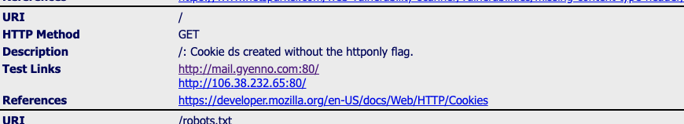

## 什么是CSRF

跨站请求伪造（英语：Cross-site request forgery），也被称为one-click attack或者session riding，通常缩写为CSRF或者XSRF，是一种挟制用户在当前已登录的Web应用程序上执行非本意的操作的攻击方法。 跟跨网站脚本（XSS）相比，XSS利用的是用户对指定网站的信任，CSRF利用的是网站对用户网页浏览器的信任。

[](https://portswigger.net/web-security/images/cross-site%20request%20forgery.svg)

## 攻击的原理

简单地说，是攻击者通过一些技术手段欺骗用户的浏览器去访问一个自己曾经认证过的网站并执行一些操作（如发邮件，发消息，甚至财产操作如转账和购买商品）。由于浏览器曾经认证过，所以被访问的网站会认为是真正的用户操作而去执行。这利用了web中用户身份验证的一个漏洞：简单的身份验证只能保证请求是发自某个用户的浏览器，却不能保证请求本身是用户自愿发出的。也就是上面所说的，利用网站对用户网页浏览器的信任。

要实现CSRF攻击，需要满足3个关键条件：

1. 攻击者有理由诱发应用程序内的某个操作。这可能是特权操作（例如修改其他用户的权限）或对用户特定数据的任何操作（例如更改用户自己的密码）。

2. 基于 Cookie 的会话处理。执行该操作涉及发出一个或多个 HTTP 请求，并且应用程序仅依赖会话 cookie 来识别发出请求的用户。没有其他机制可以跟踪会话或验证用户请求。

3. 没有不可预知的请求参数。执行操作的请求不包含攻击者无法确定或猜测其值的任何参数。例如，当导致用户更改密码时，如果攻击者需要知道现有密码的值，则该功能不易受到攻击。

### 举个栗子

- 受害者登录a.com，并保留了登录凭证（Cookie）。
- 攻击者引诱受害者访问了b.com。
- b.com 向 a.com 发送了一个请求：a.com/act=xx。浏览器会默认携带a.com的Cookie。
- a.com接收到请求后，对请求进行验证，并确认是受害者的凭证，误以为是受害者自己发送的请求。
- a.com以受害者的名义执行了act=xx。
攻击完成，攻击者在受害者不知情的情况下，冒充受害者，让a.com执行了自己定义的操作。

有这么一个请求：

```curl
POST /email/change HTTP/1.1
Host: vulnerable-website.com
Content-Type: application/x-www-form-urlencoded
Content-Length: 30
Cookie: session=yvthwsztyeQkAPzeQ5gHgTvlyxHfsAfE

email=wiener@normal-user.com
```

那么就可以这么触发：

```html
<html>
    <body>
        <form action="https://vulnerable-website.com/email/change" method="POST">
            <input type="hidden" name="email" value="pwned@evil-user.net" />
        </form>
        <script>
            document.forms[0].submit();
        </script>
    </body>
</html>
```

## 攻击的类型

### GET类型

假如一家银行用以执行转账操作的URL地址如下： `https://bank.example.com/withdraw?account=AccoutName&amount=1000&for=PayeeName`

那么，一个恶意攻击者可以在另一个网站上放置如下代码： ``

### POST类型

如上的form表单提交

### 链接类型

需要用户点击触发

`<a href="http://test.com/csrf/withdraw.php?amount=1000&for=hacker" taget="_blank">
  重磅消息！！
<a/>`

> CSRF通常是跨域的，因为外域通常更容易被攻击者掌控。但是如果本域下有容易被利用的功能，比如可以发图和链接的论坛和评论区，攻击可以直接在本域下进行，而且这种攻击更加危险。

## 防御措施

从上面的介绍，我们可以看出csrf攻击有这些特点：

1. 多发生在外域
2. 获取不到cookie，只是使用

### 同源检测

- Origin Header
  
  检查Http请求头中的Referer字段. 但是这种方式还有有局限性的，因为存在篡改Referer字段的可能。

- Referer Header

  但是Origin在以下两种情况下并不存在：

    1. IE11同源策略： IE 11 不会在跨站CORS请求上添加Origin标头，Referer头将仍然是唯一的标识。最根本原因是因为IE 11对同源的定义和其他浏览器有不同，有两个主要的区别，可以参考MDN Same-origin_policy#IE_Exceptions
    2. 302重定向： 在302重定向之后Origin不包含在重定向的请求中，因为Origin可能会被认为是其他来源的敏感信息。对于302重定向的情况来说都是定向到新的服务器上的URL，因此浏览器不想将Origin泄漏到新的服务器上。

### 添加校验token

Token不能放在Cookie中，服务器通过校验请求是否携带正确的Token，来把正常的请求和攻击的请求区分开，也可以防范CSRF的攻击。

Token是一个比较有效的CSRF防护方法，只要页面没有XSS漏洞泄露Token，那么接口的CSRF攻击就无法成功。

### 令牌同步模式

令牌同步模式（英语：Synchronizer token pattern，简称STP）

Synchronizer Token Pattern 的工作原理如下：

1. 令牌生成： 在用户登录Web应用时，服务器会为该用户生成一个唯一的令牌（也称为 CSRF 令牌或同步令牌）。这个令牌通常是随机生成的，与用户的会话相关，并且存储在会话中或者通过Cookie发送给客户端。

2. 令牌嵌入： 在Web应用中，每个可能受到CSRF攻击的请求都会在表单中嵌入这个令牌。这可以通过将令牌作为隐藏字段或自定义HTTP头部的一部分包含在请求中来实现。

3. 请求验证： 当用户提交包含令牌的请求时，服务器会验证请求中的令牌与用户会话中的令牌是否匹配。如果匹配成功，请求被视为有效。如果不匹配，服务器会拒绝请求，因为这可能是CSRF攻击的尝试。

4. 保护： 如果请求验证失败，服务器将拒绝请求，防止未经授权的操作。这种方式确保了只有知道有效令牌的用户才能执行敏感操作。

和校验token得区别

Synchronizer Token Pattern：

主要目的： 防止跨站请求伪造（CSRF）攻击。它确保每个敏感操作请求都伴随一个与用户会话相关的令牌。

工作方式： 服务器在用户登录后生成一个随机的 CSRF 令牌，并将其与用户会话相关联。每个可能受到 CSRF 攻击的请求都需要包含这个令牌。服务器在接收请求时验证令牌是否匹配用户会话中的令牌。如果匹配成功，请求被视为有效；否则，请求被拒绝。

使用 Token 进行校验的模式：

主要目的： 进行身份验证和授权。这种模式通常用于验证用户的身份，授权其访问资源或执行操作。

工作方式： 用户登录后会收到一个身份验证令牌（通常称为访问令牌或身份令牌）。客户端在每个请求中都要携带这个令牌，以证明其身份。服务器会验证令牌的有效性，如果令牌有效且具有适当的权限，则允许访问请求的资源或执行操作。

### Set-Cookie

服务器使用 Set-Cookie 响应头部向用户代理（一般是浏览器）发送 Cookie 信息。一个简单的 Cookie 可能像这样：

```http
Set-Cookie: <cookie-name>=<cookie-value>
```

现在，对该服务器发起的每一次新请求，浏览器都会将之前保存的 Cookie 信息通过 Cookie 请求头部再发送给服务器。

```http
Cookie: yummy_cookie=choco; tasty_cookie=strawberry
```

#### Secure 属性

标记为 Secure 的 Cookie 只应通过被 HTTPS 协议加密过的请求发送给服务端。它永远不会使用不安全的 HTTP 发送（本地主机除外），这意味着中间人攻击者无法轻松访问它。不安全的站点（在 URL 中带有 http:）无法使用 Secure 属性设置 cookie。但是，Secure 不会阻止对 cookie 中敏感信息的访问。例如，有权访问客户端硬盘（或，如果未设置 HttpOnly 属性，则为 JavaScript）的人可以读取和修改它。

#### HttpOnly 属性



带有 HttpOnly 属性的 cookie；此类 Cookie 仅作用于服务器。例如，持久化服务器端会话的 Cookie 不需要对 JavaScript 可用，而应具有 HttpOnly 属性。此预防措施有助于缓解跨站点脚本（XSS） (en-US)攻击。

```http
Set-Cookie: id=a3fWa; Expires=Wed, 21 Oct 2015 07:28:00 GMT; Secure; HttpOnly
```

### SameSite 属性

SameSite 属性允许服务器指定是否/何时通过跨站点请求发送（其中站点由注册的域和方案定义：http 或 https）。这提供了一些针对跨站点请求伪造攻击（CSRF）的保护。它采用三个可能的值：Strict、Lax 和 None。

>SameSite 属性允许服务器指定是否/何时通过跨站点请求发送（其中站点由注册的域和方案定义：http 或 https）。这提供了一些针对跨站点请求伪造攻击（CSRF）的保护。它采用三个可能的值：Strict、Lax 和 None。

## 总结

防护策略：

1. CSRF自动防御策略：同源检测（Origin 和 Referer 验证）。
2. CSRF主动防御措施：Token验证 或者 双重Cookie验证 以及配合Samesite Cookie。
3. 保证页面的幂等性，后端接口不要在GET页面中做用户操作。
