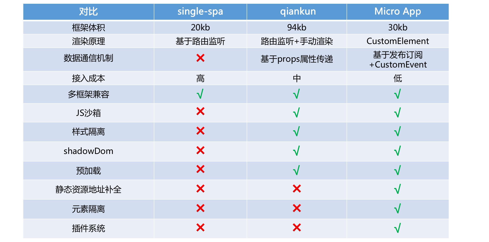

- [micro-app介绍](https://github.com/micro-zoe/micro-app/issues/8)

## 背景

需要微前端的背景，我们不再过多阐述，无非就是基于业务需求进行应用拆解，做到巨石应用的微应用化。

## micro-app的思考

### 为什么不使用qiankun？

qiankun是基于single-spa封装的微前端框架，几乎满足了所有微前端的使用场景，但是在某些方面还有一些不足。

1. 接入时对代码的侵入性，例如webpack配置修改（不支持vite），子应用的各种路由和隔离配置
2. 多方应用接入的情况下，沙箱并不能规避所有问题。例如（子应用的依赖element版本不同导致的样式冲突）

所以，像使用组件一样接入微前端成为了micro-app的实现思路

## micro-app的实现原理

### 类WebComponent + HTML Entry

> 为什么是类WebComponent？而不使用原生的WebComponent。因为WebComponent中的ShadowDom的兼容性非常不好，一些前端框架在ShadowDom环境下无法正常运行，尤其是react框架，所以采用类WebComponent

```html
<b>题外话</b>

mdn文档中提到：

> However, you should not consider this a strong security mechanism, because there are ways it can be evaded, for example by browser extensions running in the page. It's more of an indication that the page should not access the internals of your shadow DOM tree.

所以我们并不能把影子dom看成是一种强安全的隔离模式，更应该把它看成是一种浏览器的约定和机制。

```

类WebComponent的实现：

1. 元素隔离：效果和原生WebComponent一样，实现原理就是拦截原型链上元素的方法，保证子应用的操作都是在内部进行
2. js沙箱：通过Proxy代理子应用的的全局对象
3. 样式隔离： 格式化处理style和link

### 预加载的实现

基于requestIdleCallback实现的预加载

### 数据通信

由上文可知，micro-app的实现是自定义了一个`micro-app`标签，所以自然而然的，数据的通信就是通过组件属性进行。

```html
<micro-app data="{name: 'hello-world'}"></micro-app>
```

但前提是需要让元素支持对象属性，所以**重写了原型链上属性设置的方法**，将对象的属性值保存到数据中心，通过数据中心分发给子应用。

## 附一张对比图


