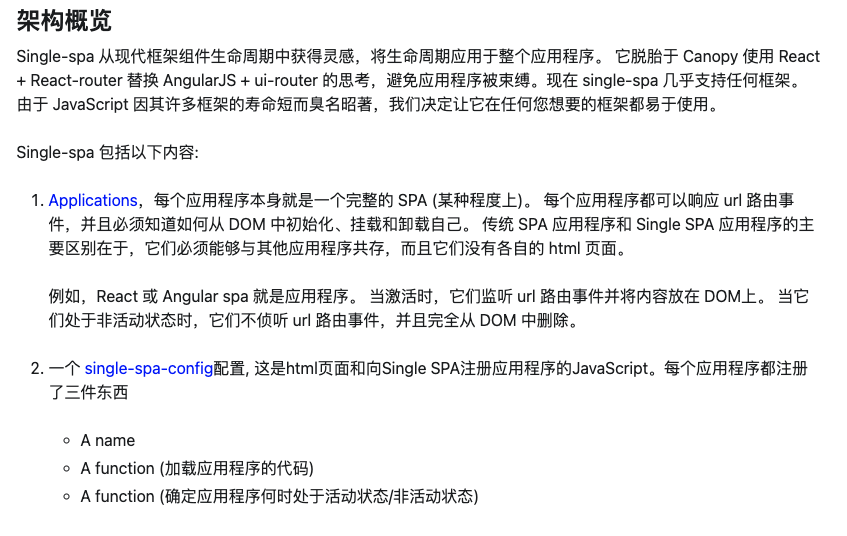

## 什么是微前端

> 微前端是一种多个团队通过独立发布功能的方式来共同构建现代化 web 应用的技术手段及方法策略。

## 面临的主要问题

1. 如何解决css污染
2. 如何解决js污染
3. 如何解决应用间通信
4. 如何保持子应用的路由状态

## iframe方案

主要是利用浏览器原生标签`<iframe>`提供的能力

### 优点

1. 浏览器原生支持，完美隔离
2. 上手简单

### 缺点

1. 隔离太完美，无法保持子应用路由状态
2. 隔离太完美，DOM结构不共享
3. 隔离太完美，每次启动都是初始化，性能有瓶颈

```html
为什么不用 iframe，这几乎是所有微前端方案第一个会被 challenge 的问题。但是大部分微前端方案又不约而同放弃了 iframe 方案，自然是有原因的，并不是为了 "炫技" 或者刻意追求 "特立独行"。

如果不考虑体验问题，iframe 几乎是最完美的微前端解决方案了。

iframe 最大的特性就是提供了浏览器原生的硬隔离方案，不论是样式隔离、js 隔离这类问题统统都能被完美解决。但他的最大问题也在于他的隔离性无法被突破，导致应用间上下文无法被共享，随之带来的开发体验、产品体验的问题。

1. url 不同步。浏览器刷新 iframe url 状态丢失、后退前进按钮无法使用。
2. UI 不同步，DOM 结构不共享。想象一下屏幕右下角 1/4 的 iframe 里来一个带遮罩层的弹框，同时我们要求这个弹框要浏览器居中显示，还要浏览器 resize 时自动居中..
3. 全局上下文完全隔离，内存变量不共享。iframe 内外系统的通信、数据同步等需求，主应用的 cookie 要透传到根域名都不同的子应用中实现免登效果。
4. 慢。每次子应用进入都是一次浏览器上下文重建、资源重新加载的过程。

其中有的问题比较好解决(问题1)，有的问题我们可以睁一只眼闭一只眼(问题4)，但有的问题我们则很难解决(问题3)甚至无法解决(问题2)，而这些无法解决的问题恰恰又会给产品带来非常严重的体验问题， 最终导致我们舍弃了 iframe 方案。
```

## single-spa方案

详情点击[官网](https://zh-hans.single-spa.js.org/docs/getting-started-overview#%E6%9E%B6%E6%9E%84%E6%A6%82%E8%A7%88)



其主要实现思路：预先注册子应用(激活路由、子应用资源、生命周期函数)，监听路由的变化，匹配到了激活的路由则加载子应用资源，顺序调用生命周期函数并最终渲染到容器。

## 乾坤的解决方案

乾坤是基于`single-spa`的封装，简化了一些配置操作，同时完善了隔离策略（js/css）,并且通过缓存策略加快打开速度。

但同时，也还是有一些其他的限制：

- 基于路由匹配，无法同时激活多个子应用，也不支持子应用保活
- 改造成本较大，从 webpack、代码、路由等等都要做一系列的适配
- css 沙箱无法绝对的隔离，js 沙箱在某些场景下执行性能下降严重
- 无法支持 vite 等 ESM 脚本运行

## 无界的解决方案

详情点击[官网](https://wujie-micro.github.io/doc/guide/)

无界还是在`<iframe>`上做文章，回顾上文的[iframe方案](#iframe方案)的缺点，我们看看无界是如何去解决的

### 路由同步机制（解决无法保持子应用路由状态）

> 劫持iframe的history.pushState和history.replaceState，就可以将子应用的url同步到主应用的query参数上，当刷新浏览器初始化iframe时，读回子应用的url并使用iframe的history.replaceState进行同步

### iframe 连接机制(解决DOM结构不共享)

- 关键点一： `webcomponent`
      子应用的实例instance在iframe内运行，dom在主应用容器下的webcomponent内

- 关键点二： 代理
      将document的查询类接口：getElementsByTagName、getElementsByClassName、getElementsByName、getElementById、querySelector、querySelectorAll、head、body全部代理到webcomponent，这样instance和webcomponent就精准的链接起来。

### 应用加载机制（解决每次启动都是初始化，性能有瓶颈）

> 将子应用的js注入主应用同域的iframe中运行，iframe是一个原生的window沙箱，内部有完整的history和location接口，子应用实例instance运行在iframe中，路由也彻底和主应用解耦，可以直接在业务组件里面启动应用。

## 总结

想要落地微前端，无非就是解决上文中的[主要问题](#面临的主要问题),
乾坤和无界都有很好的实践方案去解决。

至于选择哪个框架还是需要基于当前面临的业务场景和历史包袱去做权衡。
