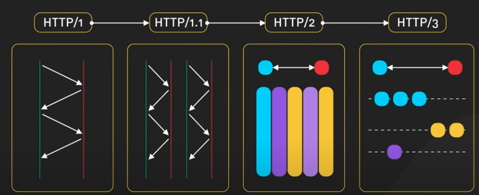
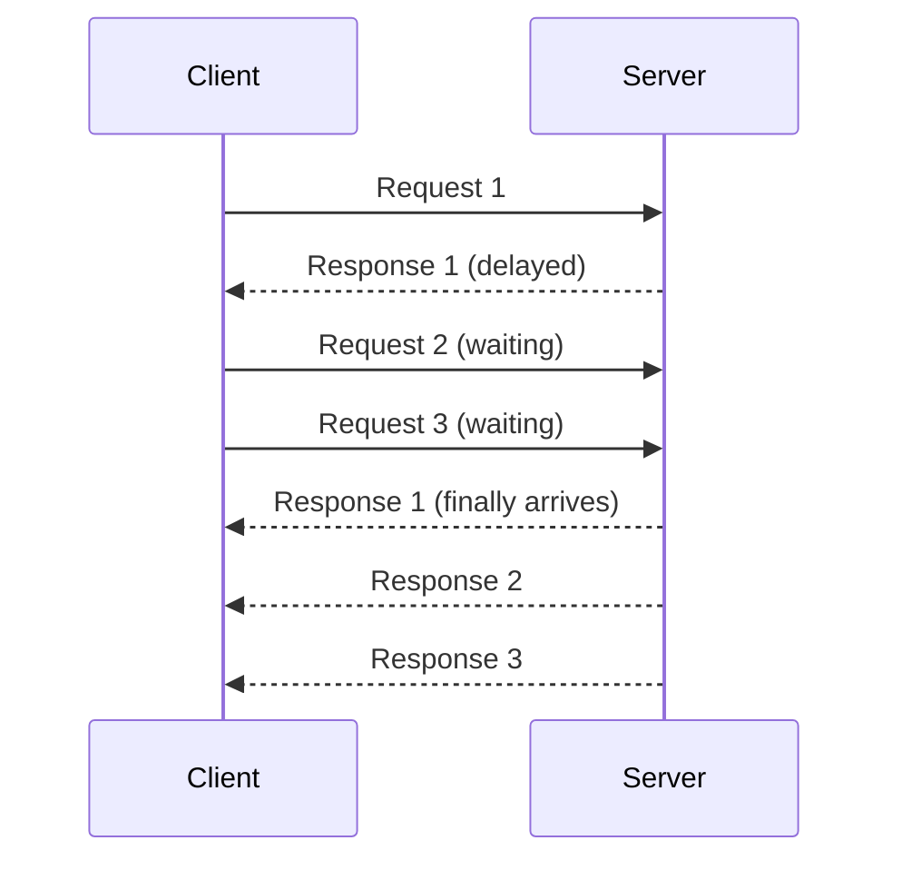
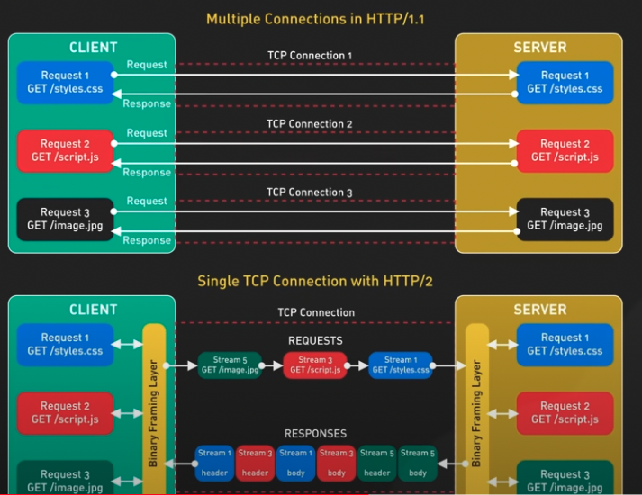

## HTTP1

1996年出现，在这之前是HTTP0.9
0.9：

1. 只有get
2. 没有请求头
3. 没有HTTP状态码，

1.0改善了这些点：

1. 增加了POST
2. 能编辑请求头
3. 并且有HTTP状态码

但是，1.0也有不足：

1. 每个链接都需要自己发起TCP链接

## HTTP1.1

1997年HTTP1.1出现了，带来了更全面的功能：

### keep-live

长链接，通过TCP握手后，这个链接不会被关闭，减少了连接和关闭的时延，
但是有数量限制（取决于浏览器的并发控制，一般是6个左右）。

通过请求头`Connection: keep-alive`开启

### pipeling

管道，它允许在一个TCP链接上发起多个请求和接受多个响应。这里需要注意的是，在一个长链接的管道上，虽然多个请求可以用同一个链接，但请求不能同时发送。

只能一个个排队来，这就造成了队头阻塞的问题：队头消息的处理延迟会阻碍后续消息的处理

#### 队头堵塞

原因：

1. HTTP/1.x 的串行性：在 HTTP/1.x 中，请求和响应是按顺序处理的。
2. TCP 的可靠性机制：TCP 协议的重传机制可能导致整个数据流的延迟。
3. 网络延迟：高延迟的网络环境会加剧队头阻塞问题。

解决办法：

1. 建立多个连接：浏览器通常会为每个域名打开多个并行连接（通常是 6 个）。
2. 域名分片：将资源分布在多个域名下，以增加可用的并行连接数。
3. HTTP/2 多路复用：HTTP/2 允许在单个 TCP 连接上并行处理多个请求和响应。
4. HTTP/3 和 QUIC：使用基于 UDP 的 QUIC 协议，进一步减少了队头阻塞。
5. 资源内联和合并：将小型资源直接嵌入 HTML 或合并多个资源，减少请求数量。

#### chunk

分块传输，服务器的数据不用一次性返回所有数据。

#### 缓存控制 cache-control/etag/if-modified-since/last-modified

控制缓存策略，协商缓存/强缓存. 这里不展开

## HTTP2

2015，他来了

针对HTTP1.1暴露出的一些问题，2带来新的功能

### 二进制协议替代文本协议

HTTP2使用的是二进制协议，不是文本协议，所以他可以将数据拆分成更小的二进制帧。数据量更小

### 多路复用

和1.*不同的是，多路复用允许在一个链接中同时发起多个请求，而无序排队等待。这是因为基于二进制帧的架构，可以通过帧的头部来标记循序，从而可以完整拼凑数据包。在一定程度上缓解队头阻塞的问题。

### service push

主动推送

### 头部压缩

在 HTTP/1.x 中，每个请求都会发送完整的头部信息，这导致了大量的冗余数据传输。特别是在移动网络环境下，这种冗余会显著影响性能。HTTP/2 引入了 HPACK 压缩格式来解决这个问题。

## HTTP3

2022，他又来了

本质的区别，没有基于TCP协议，而是基于UDP协议去实现。

### 无队头阻塞

协议不一样，从根本解决队头阻塞

### 无感知的网络切换

移动端设备在从wifi切换为5g或者4g时，是不会断线重连